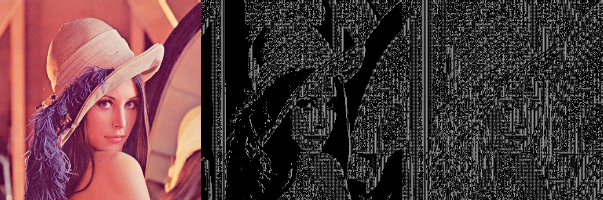
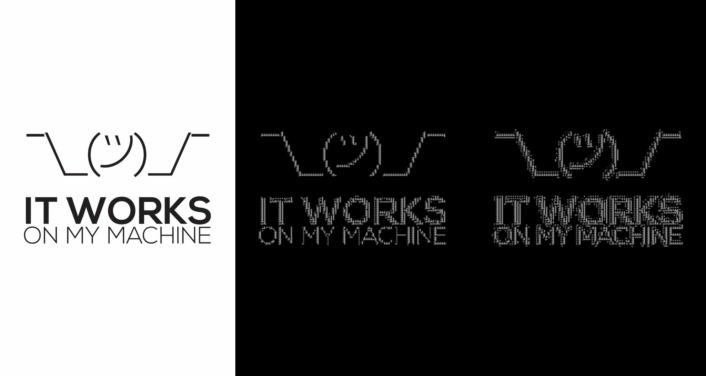
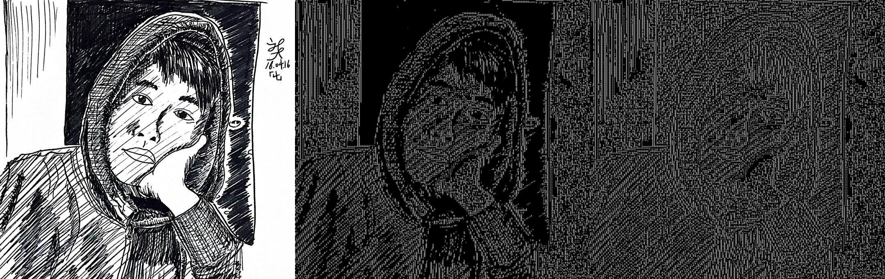

# Image Textifier

- Left : source, Middle : Binarized, Right : As-is
  
  
  

Create an image made with texts out of an image.
This small toy is to study python.

#### Dependency:

> OpenCV
> NumPy

#### Generating dataset (ImageTextifierPreproc.py) :

1.  Prepare alphabets, numbers, and characters
1.  Make those as a set of binary images

#### Process (ImageTextifier.py) :

1.  Preprocess : Source(wid \* hi) to gray, then blur
1.  If binarize is on, extract ROI : Apply Otsu binarization as ROI mask
1.  Begin comparing
    - Divide ROI mask into blocks of N\*N (default : N=30)
    - Compare each block with pre-maid text images, and choose one with the highest score
1.  Return
    - texts
    - an image with texts on it

#### TODO

- Speed up using multiproc/th

#### Thins I've learned

- Python environment setup using Conda
- Basic OpenCV & NumPy
