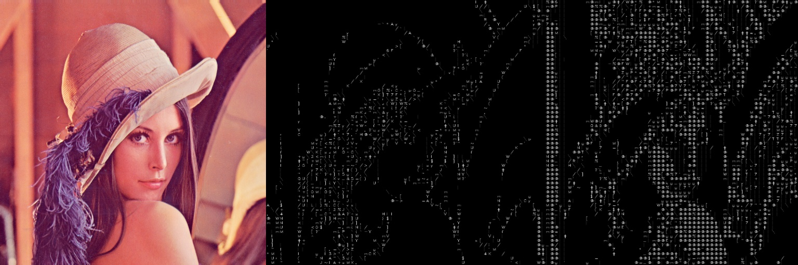

# Image Textifier

- Row1 : Low resolution, Row2 : Medium resolution
- Left : source, Middle : Derivative, Right : Binarized
  
  

Create an image made with texts out of an image.  
This small toy is to study python.

### Dependency:

> OpenCV (Probably any version will fit)

### Example:

```python
from ImageTextifier import ImageTextifier
import cv2

def simple_example():
  textifier = ITEX.ImageTextifier()
  result_text, result_image = textifier.textify(cv2.imread("img_path.jpg"))
```

- For more options, refer to _full_function_example()_ in [example.py](example.py)

### Generating dataset

1.  Prepare alphabets, numbers, and characters
1.  Make those as a set of binary images

### Process (ImageTextifier.py)

1.  Preprocess : Source(wid \* hi) to gray, blur, canny
1.  Begin comparing
    - Divide ROI mask into blocks(Higher blocks means higher resolution)
    - Compare each block with pre-maid text images, and choose one with the highest score
1.  Return
    - texts
    - an image with texts on it

### TODO

- Speed up using multiprocess/threads

### Things I've learned

- Python environment setup using Conda
- Basic OpenCV & NumPy
